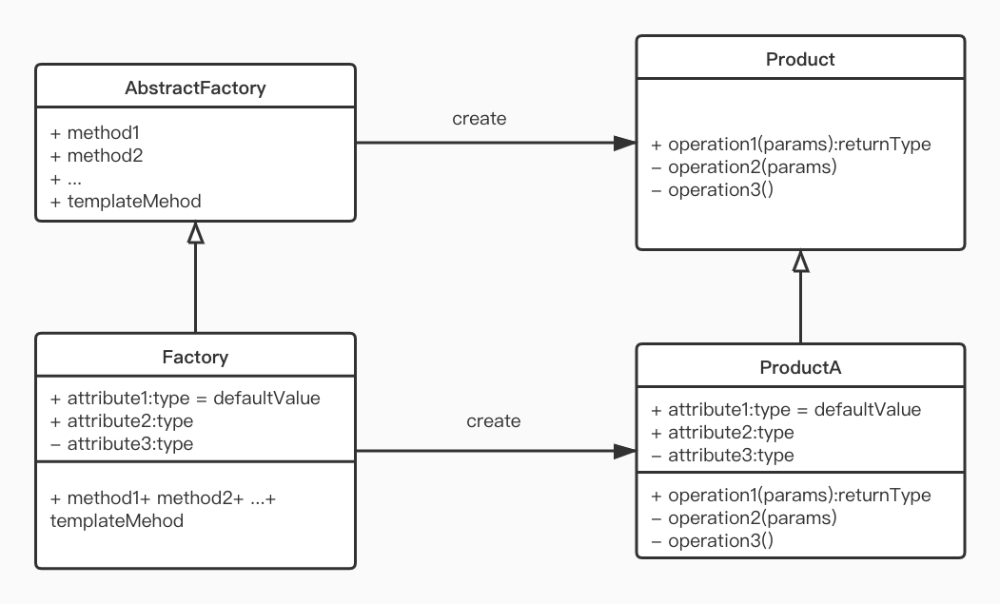

# Factory Method 模式(工厂方法模式)
工厂方法模式，又称工厂模式、多态工厂模式和虚拟构造器模式，通过定义工厂父类负责定义创建对象的公共接口，而子类则负责生成具体的对象。  
工厂方法模式 = 简单工厂模式 + 模板方法模式  
工厂方法模式采用[Template Method 模式](../template-method/TemplateMethod.md)构建生成实例的工厂。  
[Iterator 模式](../iterator/Iterator.md)中 iterator 方法生产 Iterator 实例时使用 Factory Method 模式。 
 
## 优点
- 调用者创建实例，只需要知道其名称
- 符合单一设计原则
- 符合开-闭原则，扩展性高。如果想增加一个产品，只需要扩展一个工厂类。
- 屏蔽产品的具体实现，调用者只关心产品的接口
## 缺点
- 每次增加一个产品，都需要增加一个具体的类和对象实现工厂，使系统中类的个数成倍增加，增加了系统的复杂度，不利于维护。
- 虽然保证了工厂方法内的对修改关闭，但对于使用工厂方法的类，如果要更换另外一种产品，仍然需要修改实例化的具体工厂类；  
## 场景
- 当一个类不知道它所需要的对象的类时 
  在工厂方法模式中，客户端不需要知道具体产品类的类名，只需要知道所对应的工厂即可
- 当一个类希望通过其子类来指定创建对象时 
  在工厂方法模式中，对于抽象工厂类只需要提供一个创建产品的接口，而由其子类来确定具体要创建的对象，利用面向对象的多态性和里氏代换原则，在程序运行时，子类对象将覆盖父类对象，从而使得系统更容易扩展
- 将创建对象的任务委托给多个工厂子类中的某一个，客户端在使用时可以无须关心是哪一个工厂子类创建产品子类，需要时再动态指定，可将具体工厂类的类名存储在配置文件或数据库中
### 实例
- 日记记录器。
- 数据库访问。
- 设计一个连接服务器框架，需要三个协议(POP3, IMAP, HTTP),可以把三个作为产品类，共同实现一个接口。
- etc...
## 注意
- 任何需要生成复杂对象的时候，都可以使用 Factory Method 模式。
- 复杂对象适合使用工厂模式实现，简单对象只需要通过 new 实现即可。
## JDK 实例
java.lang.Boolean#valueOf(String)