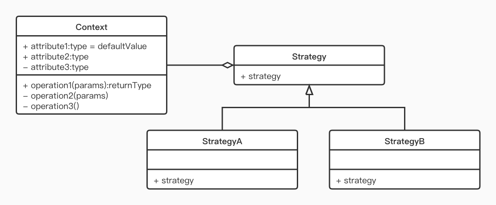

# Strategy 模式(策略模式)
在 策略模式中，一个类的行为或其算法可以在运行时更改。  
在策略模式中，创建表示各种策略的对象和一个行为随着策略对象改变的 context 对象。策略对象改变 context 对象的执行算法。  
策略模式是特意将算法和其他部分分离开来，只是定义了相关的接口(API),然后在程序中以委托的方式来使用算法。  

## 优点
- 算法可以自由切换
- 避免使用多重条件判断
- 扩展性良好
## 缺点
- 策略类会增多
- 所有策略类都需要对外暴露
## 使用场景
- 如果一个系统中有多个类，他们之间的区别仅在于他们的行为，
那么使用策略模式可以动态地让一个对象在许多行为中选择一种行为
- 一个系统需要动态的在几种算法中选择一种
- 如果一个对象有很多的行为，如果不用恰当的模式，这行应为就只能使用多重的条件选择语句实现
## 注意事项
- 一个系统的策略多于四个时则需要烤炉使用混合模式，解决策略类膨胀的问题
## JDK 实例
- AWT 中的 LayoutManager
- ava.util.Comparator#compare()
- javax.servlet.http.HttpServlet
- javax.servlet.Filter#doFilter()
