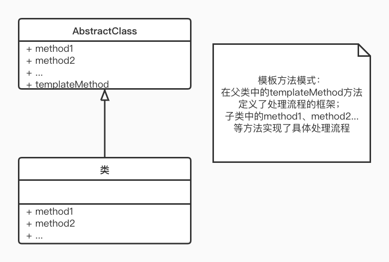

# Template Method 模式(模板方法模式)
Template Method 模式 是带有模板功能的模式，组成模板的方法被定义在父类中。  
Template Method 模式是指在父类中定义处理流程的框架，在子类中定义具体处理的模式。  
父类和子类是紧密联系，共同工作。    

## 优点
- 封装不变部分。把公共不变的方法封装在父类中，子类负责具体实现。
- 扩展可变部分。增加功能由子类实现基本方法的扩展。符合单一性和开闭原则。
- 提取公共代码，便于维护(可复用性)
- 行为由父类控制，子类实现
## 缺点
- 每个不同的实现需要一个新的子类实现，导致类的个数增加，使系统变得复杂。
- 通过继承实现代码复用，降低了灵活度
- 子类执行影响父类结果，增加代码阅读难度。  
## 场景
- 多个子类共有的方法，且逻辑相同
- 重要的、复杂的方法，可以考虑模板模式
- 父类中实现了某种算法，无需在子类中再次编写算法
## 注意事项
- 为了防止恶意操作，一般模板方法都加上 final 关键字
## JDK 实例
- `java.io.InputStream` 的 `read()` 方法(不带参数)，会被 模板方法 `read(byte[] b, int off, int len)` 循环调用。
## 相关设计模式
- [Simple Factory 模式(简单工厂模式)](../simple-factory/simpleFactory.md)
- [Strategy 模式(策略模式)](../strategy/strategy.md)

